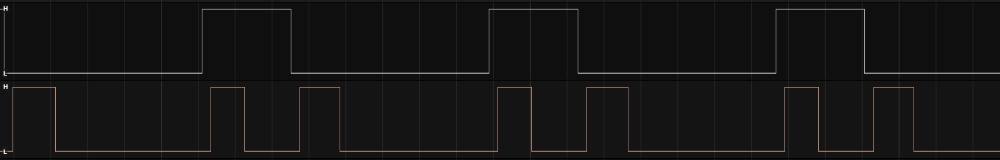
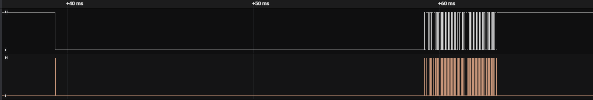

# Non blocking DHT11 driver
This repository contains library for DHT11 temperature and humidity module.
DHT11 requires 18ms delay in its read start sequence. This library has separate API for beginning and end of this sequence, it's up to the user to decide how to implement the delay (blocking, state machine or RTOS task based).

## Usage
1. Modify HAL include in `dht11.h` if needed.  
2. Configure pin that is connected to DHT11 as EXTI interrupt on falling and rising edge
3. Configure timer for 1us tick
4. Initialize `DHT11_TypeDef` with: pointer to data buffer, pointer to timer handle, GPIO pin and GPIO Port.
5. Put `DHT11_IRQHandler` in interrupt handler or EXTI callback.
6. Implement function `void DHT11_RecieveCpltCallback(DHT11_TypeDef *dht)`
7. Call `DHT11_Start_Init`
8. Wait for ~18ms
9. Call `DHT11_Start_End`
10. DHT11 will send data now, it will be available after callback executes.

## Recieved data
Data is saved in 5 byte long buffer, meaning of bytes:
1. Humidity - integral part
2. Humidity - decimal part (always 0 on DHT11)
3. Temperature - integral part
4. Temperature - decimal part
5. Checksum - should be equal to a sum of previous bytes in buffer

## Interrupts and data transmission
Interrupts (orange) and transmitted bits (white):
 
  
Full data transmission:

